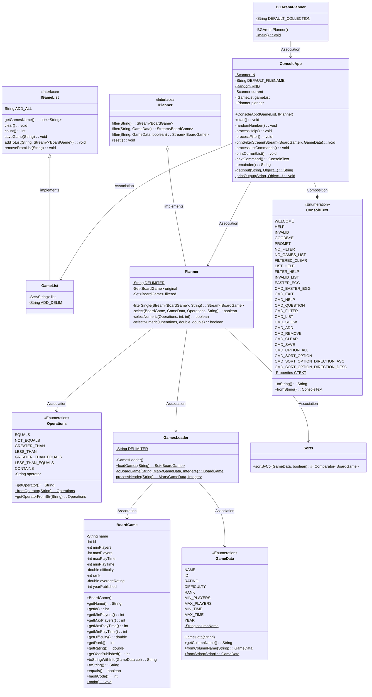

# Board Game Arena Planner Design Document

This document is meant to provide a tool for you to demonstrate the design process. You need to work on this before you code, and after have a finished product. That way you can compare the changes, and changes in design are normal as you work through a project. It is contrary to popular belief, but we are not perfect our first attempt. We need to iterate on our designs to make them better. This document is a tool to help you do that.

## (INITIAL DESIGN): Class Diagram 

Place your class diagrams below. Make sure you check the file in the browser on github.com to make sure it is rendering correctly. If it is not, you will need to fix it. As a reminder, here is a link to tools that can help you create a class diagram: [Class Resources: Class Design Tools](https://github.com/CS5004-khoury-lionelle/Resources?tab=readme-ov-file#uml-design-tools)

### Provided Code

Provide a class diagram for the provided code as you read through it.  For the classes you are adding, you will create them as a separate diagram, so for now, you can just point towards the interfaces for the provided code diagram.

### Your Plans/Design

Create a class diagram for the classes you plan to create. This is your initial design, and it is okay if it changes. Your starting points are the interfaces. 

## (INITIAL DESIGN): Tests to Write - Brainstorm

Write a test (in english) that you can picture for the class diagram you have created. This is the brainstorming stage in the TDD process. 

> [!TIP]
> As a reminder, this is the TDD process we are following:
> 1. Figure out a number of tests by brainstorming (this step)
> 2. Write **one** test
> 3. Write **just enough** code to make that test pass
> 4. Refactor/update  as you go along
> 5. Repeat steps 2-4 until you have all the tests passing/fully built program

You should feel free to number your brainstorm. 

1. Test Constructor for Planner.
2. Test filter() methods in Planner does nothing for empty string.
3. Test filter() methods in Planner does nothing for empty string after a dame data and operator.
4. Test filter() in Planner properly filters names with EQUAL.
5. Test filter() in Planner properly filters names with CONTAINS.
6. Test filter() in Planner properly filters names with NOT_CONTAINS.
7. Test filter() in Planner properly filters names with comparison operators.
8. Test reset() in Planner successfully clear all the filter conditions.
9. Test filter() in Planner properly filters multiple conditions.
10. Test filter() in Planner properly filters multiple conditions and sorts the data.
11. Test Constrctor for GameList.
12. Test count() in GameList properly returns the number of games in list.
13. Test getGameNames() in GameList successfully returns a list of game names.
14. Test clear() in GameList clear all the games in the list.
15. Test addToList() in GameList properly add single game by string of game name. 
16. Test addToList() in GameList throws exception if the name of game does not exist.
17. Test addToList() in GameList properly add single game by index.
18. Test addToList() in GameList throws exception if the index is out of range.
19. Test addToList() in GameList add all games by "add all".
20. Test addToList() in GameList properly add many games by range within the range.
21. Test addToList() in GameList properly add many games by range partially out of the range.
22. Test addToList() in GameList throws exception by range out of range.
23. Test removeFromList() in GameList properly removes a single game by string of the game name.
24. Test removeFromList() in GameList throws exception by removing a game that name does not exist.
25. Test removeFromList() in GameList properly removes a game by index.
26. Test removeFromList() in GameList properly removes a game by a range.
27. Test removeFromList() in GameList properly removes a game by a range partially out of range.
28. Test removeFromList() in GameList throws exception by a range out of the range.
29. Test removeFromList() in GameList returns an empty list when removing all from a empty list.
30. Test removeFromList() in GameList throws exception when removing a game from empty list.

## (FINAL DESIGN): Class Diagram

Go through your completed code, and update your class diagram to reflect the final design. Make sure you check the file in the browser on github.com to make sure it is rendering correctly. It is normal that the two diagrams don't match! Rarely (though possible) is your initial design perfect. 

For the final design, you just need to do a single diagram that includes both the original classes and the classes you added. 

> [!WARNING]
> If you resubmit your assignment for manual grading, this is a section that often needs updating. You should double check with every resubmit to make sure it is up to date.

## (FINAL DESIGN): Reflection/Retrospective

> [!IMPORTANT]
> The value of reflective writing has been highly researched and documented within computer science, from learning to information to showing higher salaries in the workplace. For this next part, we encourage you to take time, and truly focus on your retrospective.

Take time to reflect on how your design has changed. Write in *prose* (i.e. do not bullet point your answers - it matters in how our brain processes the information). Make sure to include what were some major changes, and why you made them. What did you learn from this process? What would you do differently next time? What was the most challenging part of this process? For most students, it will be a paragraph or two. 

The biggest change in deisgn is how I developed the unit tests in the process of test driven development. At first, I spent a tremendous amount of time perusing the whole project, trying to understand every details. However, even after fist reading, I was still befogged. Thus I tried to start out on designing unit tests and have them passed one after another and finally when all the cases that I can imagine are resolved, the implementation of the planner and list operation are achieved by gradual progress.
 This projects provides a good practices for TDD and I am getting on this way of developing.